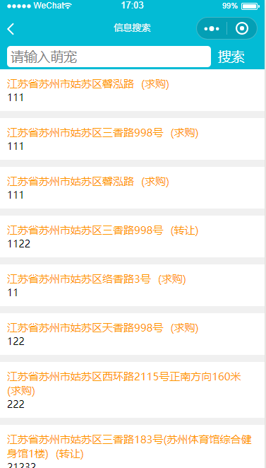

# 萌宠平台

该平台有四个页面构成：

* 首页 
    * 主要功能：显示当前位置，在地图上渲染交易信息
    * 用到的组件或api: wx.getLoaction(), 地图组件(`<map>`)，导航组件(`<navigator\>`), 获得系统信息(wx.systemInfo)，发送请求(wx.request())

* 发布信息
    * 主要功能：发布信息
    * 用到的组件或api: input, radio, 选择地址(wx.chooseLocation()), 发送请求(wx.request())

* 信息详情
    * 主要功能：展示交易详情
    * 用到的组件或api: input, radio, 选择地址(wx.chooseLocation()), 发送请求(wx.request())

* 信息搜索
    * 主要功能：展示交易列表，搜索
    * 用到的组件或api: input, 发送请求(wx.request())

## 效果图
    
  
   

## 后台接口
1. 开启mongodb
2. 进入serve文件夹
> $ cd ./serve   
3. 开启node服务器
> $ node app.js

